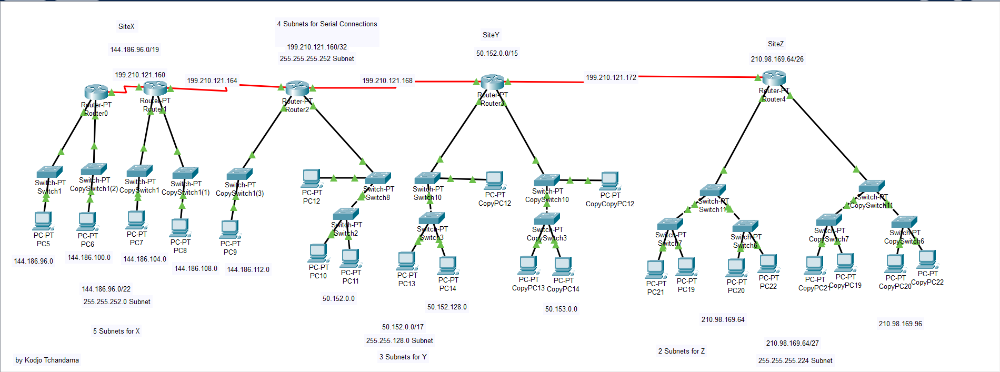

# Enterprise Network Topology Design - Cisco Packet Tracer

This project features a multi-site network infrastructure designed and simulated in **Cisco Packet Tracer**. The architecture focuses on efficient **Classless Subnetting (VLSM)** and dynamic routing to interconnect three distinct corporate locations.

## 🗺️ IP Addressing Plan

The network is segmented into three primary sites and a dedicated serial backbone. Each site is further divided into subnets to support individual rooms/departments.

### 1. Inter-Router Serial Backbone
* **Network:** `199.210.121.160/28`
* **Purpose:** Facilitates serial communication between Site routers.
* **Segments:** Divided into `/30` point-to-point links (e.g., `.160`, `.164`, `.168`, and `.172`).

### 2. Site X (5 Rooms)
* **Base Network:** `144.186.96.0/19`
* **Local Subnet Mask:** `255.255.252.0 (/22)`
* **Configuration:** Supports 5 distinct rooms, each residing on its own sub-network to allow for future host expansion.

### 3. Site Y (3 Rooms)
* **Base Network:** `50.152.0.0/15`
* **Local Subnet Mask:** `255.255.128.0 (/17)`
* **Configuration:** Supports 3 rooms with 3 PCs each, optimized for high-capacity host addressing.

### 4. Site Z (2 Rooms)
* **Base Network:** `210.98.169.64/26`
* **Local Subnet Mask:** `255.255.255.224 (/27)`
* **Configuration:** Supports 2 rooms with 4 PCs each using a compact classless address space.

## ⚙️ Protocols & Implementation

* **Routing Protocol:** **RIPv2 (Routing Information Protocol version 2)**. 
  * Configured via **CLI** to support Classless Inter-Domain Routing (CIDR) and VLSM.
  * Ensures full "any-to-any" connectivity across all sites.
* **Switching Logic:** Implemented using Generic Switches with a strict constraint of utilizing only **3 out of 4 available Ethernet ports** per device to simulate hardware-limited environments.
* **IP Allocation:** All end-devices (PCs) are configured with **Static IP addresses** and appropriate Default Gateways.

## 🚀 How to Run

1.  **Environment:** Open the project in **Cisco Packet Tracer (v6.2 or later)**.
2.  **Verification:** The network is fully converged ("The whole network is working!!!!!").
3.  **Testing:** * Access the **Desktop > Command Prompt** on any PC.
    * Execute `ping [Target_IP]` to verify cross-site communication.
    * Use the **Simulation Panel** to observe RIPv2 update packets and ICMP traffic flow.
  
## Author

Kodjo Lucien Tchandama

---
*Developed as a practical application of Classless Subnetting and Router CLI configuration.*
